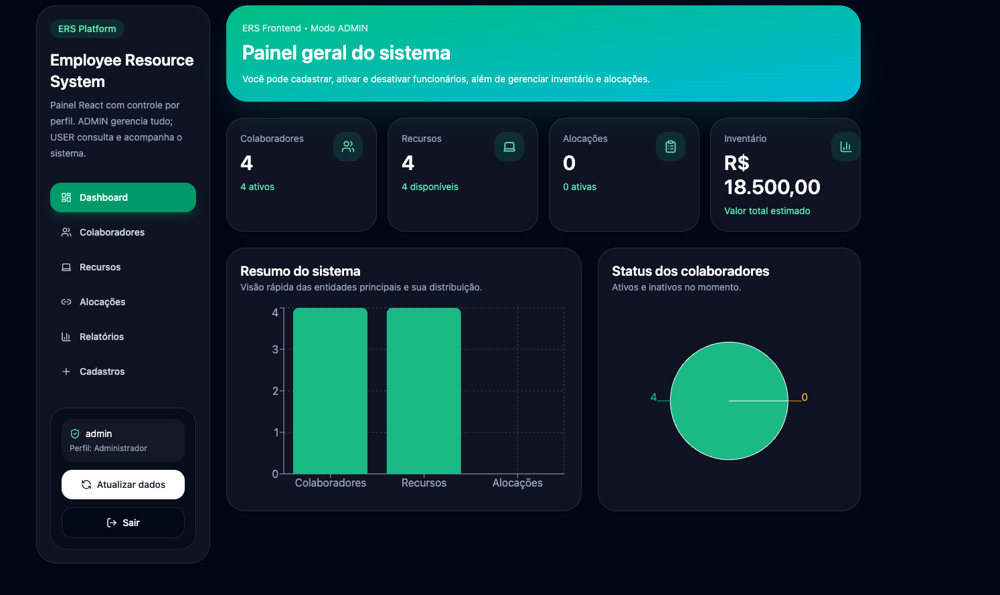
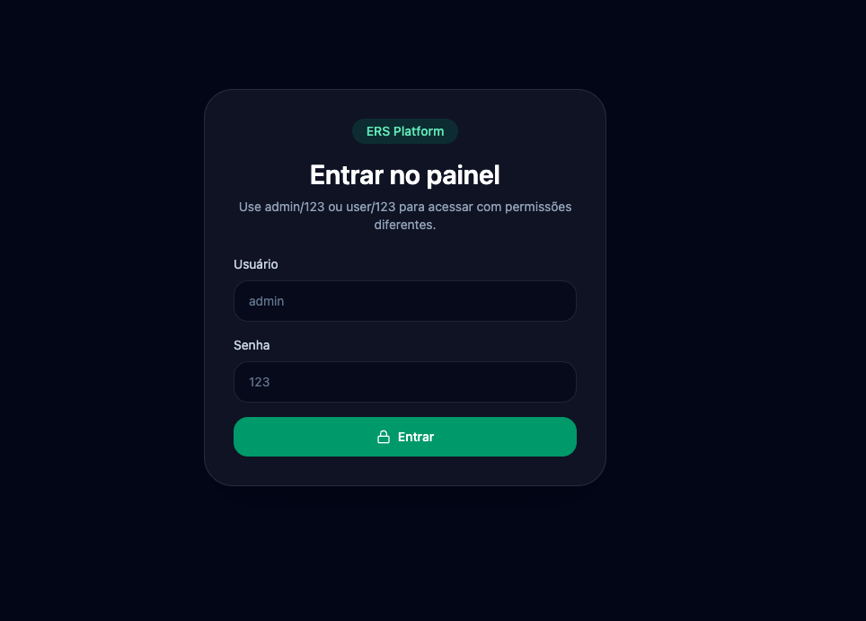
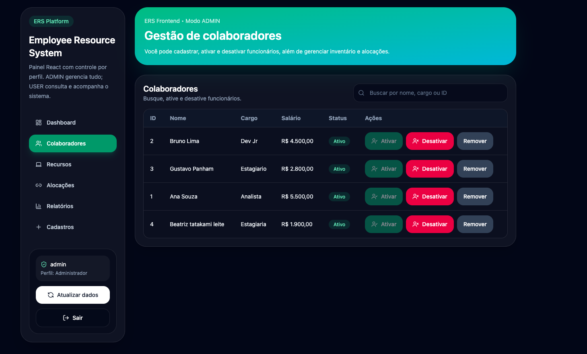
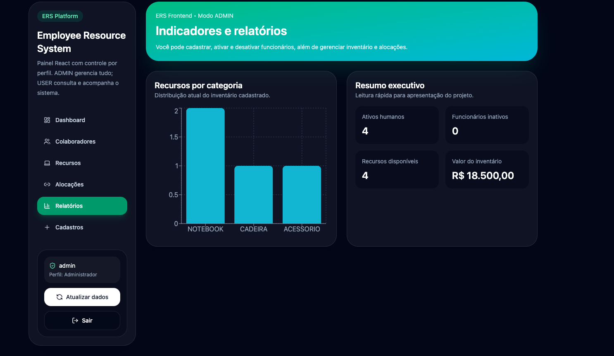
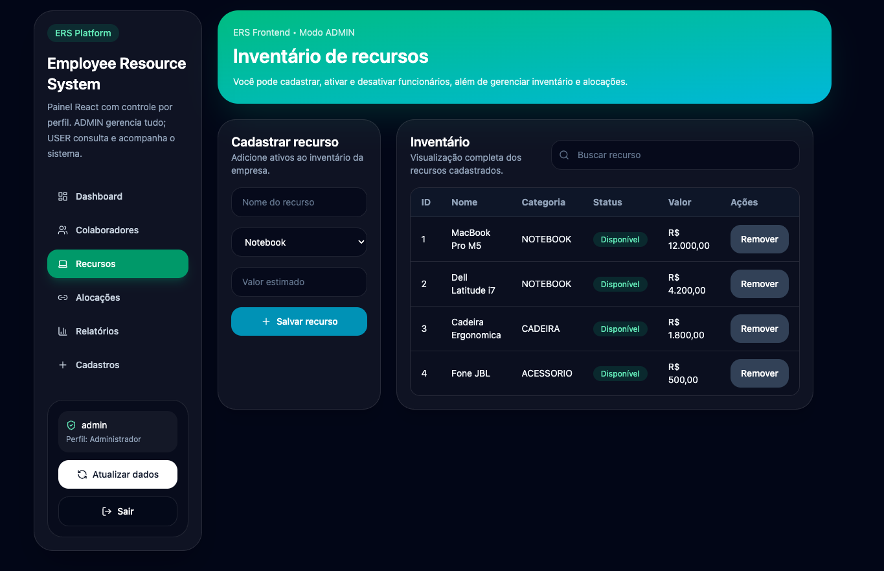

# 🏢 Employee Resource System (ERS)


> Sistema corporativo completo para gestão de colaboradores e recursos internos, com regras de negócio reais, persistência de dados e interface web.

---

## 📸 Demonstração

### 💻 Tela Principal 


### 🔐 Controle de Permissões


### 📊 Gestão de Colaboradores


### 🔄 Alocações


### 📊 Gestão de Recursos 



---

## 📌 Sobre o Projeto

O **Employee Resource System (ERS)** é um sistema backend + interface web que simula um ambiente corporativo real para gestão de ativos e colaboradores.

Ele permite:

- Controle de colaboradores
- Gestão de recursos internos
- Alocação de recursos
- Validação de regras de negócio
- Controle de permissões por perfil
- Persistência de dados
- Monitoramento por logs

---

## 🎯 Problema Resolvido

Empresas frequentemente enfrentam:

- Falta de controle sobre ativos internos
- Uso indevido de recursos de alto valor
- Ausência de rastreabilidade
- Sistemas descentralizados

💡 O ERS resolve isso com:

- Centralização das informações
- Regras automatizadas de validação
- Controle por perfis de acesso
- Histórico completo de ações

---

## 🧩 Funcionalidades

### 👥 Colaboradores
- Cadastro de colaboradores
- Ativação e desativação
- Busca por nome
- Histórico de eventos

### 📦 Recursos
- Cadastro de recursos
- Controle de disponibilidade
- Classificação por valor
- Histórico de uso

### 🔄 Alocação
- Associação de recursos a colaboradores
- Controle de disponibilidade
- Validação automática

### 🔐 Permissões
- Login com perfis:
  - `admin`
  - `user`
- Controle de acesso por role
- Restrição para ações críticas

### 📊 Sistema
- Persistência em CSV
- Logs de operações
- Filtros de dados
- Relatórios gerenciais

### 🌐 API HTTP
- Endpoints REST locais:
  - `GET /colaboradores`
  - `POST /colaboradores`
  - `GET /recursos`
  - `POST /recursos`
  - `GET /alocacoes`
  - `POST /alocacoes`

### 💻 Interface Web
- Interface local para interação com o sistema
- Integração com backend

---

## 🏗️ Arquitetura

```text
📁 src/br/com/ers
 ┣ 📂 model        → Entidades (Colaborador, Recurso, Alocacao)
 ┣ 📂 repository   → Persistência (CSV)
 ┣ 📂 service      → Regras de negócio
 ┣ 📂 api          → API HTTP
 ┗ 📂 util         → Utilitários (logs, helpers)

📁 Outras pastas:

📁 data           → Arquivos CSV
📁 web            → Interface web
📁 ers-frontend   → Frontend adicional
⚙️ Tecnologias
☕ Java (POO)
📂 CSV (persistência)
🌐 HTTP Server nativo
🎨 HTML, CSS, JavaScript
🧠 Arquitetura em camadas
▶️ Como Executar
git clone https://github.com/PauloCesar-hub/employee-resource-system.git
cd employee-resource-system
Executar backend

Abra na IDE (IntelliJ) e execute a classe principal.

Acessar frontend

Abra os arquivos da pasta web/ no navegador.

🔑 Acesso ao Sistema
Admin:
login: admin
senha: 123

User:
login: user
senha: 123

📊 Roadmap

✅ Já implementado
 Arquitetura em camadas
 CRUD de colaboradores
 CRUD de recursos
 Controle de alocações
 IDs automáticos
 Persistência em CSV
 Logs do sistema
 Histórico de eventos
 Login com roles (admin/user)
 Controle de permissões
 API HTTP local
 Interface web
 Filtros e relatórios
Dashboard com gráficos

🚧 Próximas evoluções
 Melhorias visuais no frontend
 Testes automatizados
 Banco de dados (MySQL/PostgreSQL)
 Autenticação avançada (JWT)
 Deploy em nuvem

🧠 Decisões Técnicas
Separação clara entre camadas (model, service, repository)
Persistência simples com CSV para facilitar testes
API HTTP sem frameworks para controle total
Estrutura preparada para evolução para REST + banco

Este projeto demonstra:

🔥 Hard Skills
Backend Java
Modelagem de domínio
Arquitetura de software
Regras de negócio reais
API HTTP

🧠 Soft Skills técnicas
Organização de código
Pensamento sistêmico
Escalabilidade

👉 Projeto ideal para vagas de:

Estágio em desenvolvimento
Backend Júnior
Full-stack Júnior

📂 Estrutura do Projeto
employee-resource-system/
 ┣ src/
 ┣ data/
 ┣ web/
 ┣ ers-frontend/
 ┣ docs/
 ┣ README.md
 ┗ .gitignore

🤝 Contribuição
git checkout -b feature/nova-feature
git commit -m "feat: nova funcionalidade"
git push origin feature/nova-feature

👨‍💻 Autor

Paulo Cesar de Govea

🎓 Engenharia de Software - FIAP
💻 Desenvolvedor Full-Stack
🔗 https://github.com/PauloCesar-hub
